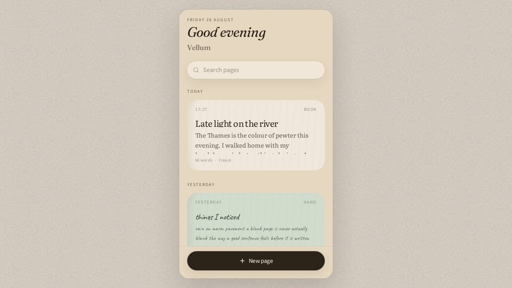
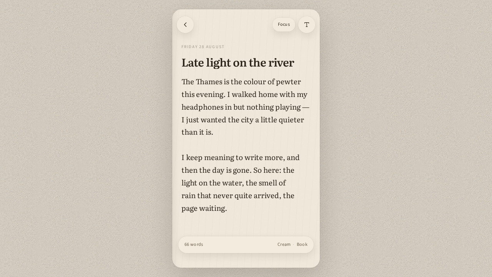
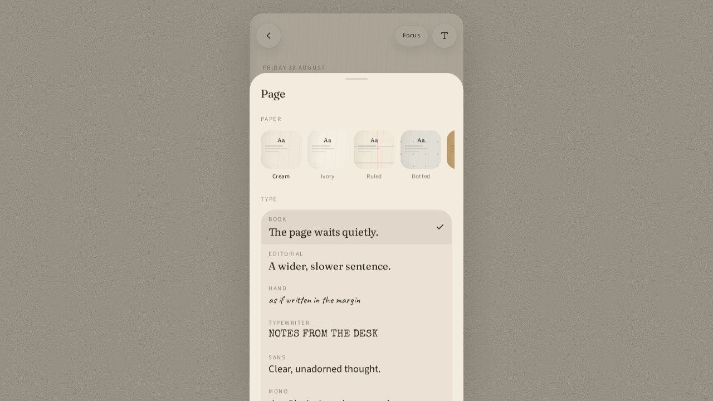

# Vellum

A writing app that feels like paper.

| | |
| --- | --- |
| **Code (public)** | [github.com/glowly112/vellum](https://github.com/glowly112/vellum) |
| **Brief** | [Vellum on Notion](https://app.notion.com/p/3ca2661264338157a7b9da5d8bd08d6f) |
| **Live app** | [vellum-ib7s.vercel.app](https://vellum-ib7s.vercel.app/) |

This is a working prototype, not a notes product with accounts, sync, or folders. The point is the *feeling* of sitting down at a desk with a sheet of paper — not a document editor, not a productivity suite.



## Intention

Most writing apps are tools first: files, folders, markdown, slash commands, sync. Vellum is a **desk**. You open it, you see a small stack of pages, you write. Chrome recedes. The paper, type, ink, and size of each page are part of the writing, not a theme toggle buried in settings.

It is deliberately phone-shaped even on a laptop: a single sheet on a wooden desk, not a three-pane IDE.

### Product locks

- **Pages, not documents.** No folders, tags, or notebooks. Recency is the only organisation (Today / Yesterday / This week / Earlier).
- **Local only.** The web desk stores pages in the browser (`localStorage` key `vellum-pages-v1`). The native iOS app stores them in SwiftData on device. No accounts, no server, no sync. That is a choice for the prototype, not a missing feature.
- **Style belongs to the page.** Paper, typeface, ink, and size are stored per page. The last choice becomes the default for the next blank sheet.
- **Focus is a mode.** Tap Focus and the chrome fades. Tap the top of the sheet to come back.
- **Quiet chrome.** No sidebars, no toolbars of formatting, no markdown preview. Title + body. Word count lives on a thin bar at the bottom of the sheet.

### What you can do today

1. Open the library — greeting, date, search, a stack of page cards.
2. Start a new page, or tap an existing one.
3. Write a title and body. Autosaves as you type.
4. Open **Page** (type icon, or the bottom bar) and change paper / type / size / ink.
5. Tap **Focus** to hide chrome.
6. Delete a page from the style drawer (two-tap confirm).





## Stack

| Layer | Choice |
| --- | --- |
| Web UI | React 19 + TanStack Start / Router |
| Web styling | Tailwind v4, paper textures in CSS |
| Web state | Zustand + `persist` (localStorage) |
| Web deploy | Vercel (Nitro `vercel` preset) |
| Native iOS | SwiftUI + SwiftData, Xcode 26 / iOS 26 (`ios/VellumPad`) |
| Auth / DB | Off. Scaffolding in `src/lib/auth` and `src/lib/db` is unused. |

Node 22. The native app is a separate Xcode project — it does not wrap the Vercel URL, Capacitor, or WKWebView.

## Run it

```bash
npm install
npm run dev
```

The app listens on port 8080. Production build:

```bash
npm run build
npm run preview
```

Native iOS (Xcode 26, iOS 26 SDK) — open `ios/VellumPad/VellumPad.xcodeproj`. Display name **Vellum Pad**, bundle ID `com.jamiematheson.vellumpad`, version 1.0.0 (5). Catalogue type is the same OFL faces as the web desk (`ios/VellumPad/VellumPad/Fonts`). Prove: `xcodebuild -project ios/VellumPad/VellumPad.xcodeproj -scheme VellumPad -destination 'generic/platform=iOS' -configuration Debug build`. The production pass bar is false until a Simulator keyboard pass.

## Where to change things

| Want | File |
| --- | --- |
| Library (home) | `src/routes/index.tsx` |
| Editor | `src/routes/write.$pageId.tsx` |
| Page cards | `src/components/library-card.tsx` |
| Paper textures | `src/components/paper-surface.tsx`, `src/styles.css` |
| Style drawer | `src/components/style-drawer.tsx` |
| Fonts, papers, inks, sizes | `src/lib/catalog.ts` |
| Pages + persistence | `src/lib/store.ts` |
| Phone-on-desk chrome (web only) | `src/components/app-frame.tsx` |
| Colour / type tokens | `src/styles.css` (`@theme`) |
| Native iOS app | `ios/VellumPad` |
| Native chrome map | `ios/REFS.md` |

Sample pages ship with the store so an empty first visit still looks like a used desk. They persist after first load; clearing site data restores them.

## Working on it

This repo is public. Fork, branch, open a pull request.

Please keep the prototype *small*. A good change makes the paper feel more like paper, or the chrome quieter. A bad change adds a sidebar, markdown toolbar, cloud sync, or a settings screen.

Suggested next slices (only if they stay in character):

- Web export as plain `.txt` / print-to-PDF (iOS already shares `.txt`)
- Optional passcode lock (still local)
- A second sample handwriting paper
- Bundle OFL webfonts in the iOS target if Georgia / Palatino feel too far from Literata / Fraunces

Do **not** add: folders, tags, rich text, collaboration, accounts, or a web-app sidebar.

## Status

Prototype. Built August 2026. The web desk is usable in the browser. A native SwiftUI iOS 26 app lives in `ios/` but the production pass bar is **false** until `xcodebuild` and a Simulator keyboard pass succeed. Not submitted to App Review. Not a shipping product.
